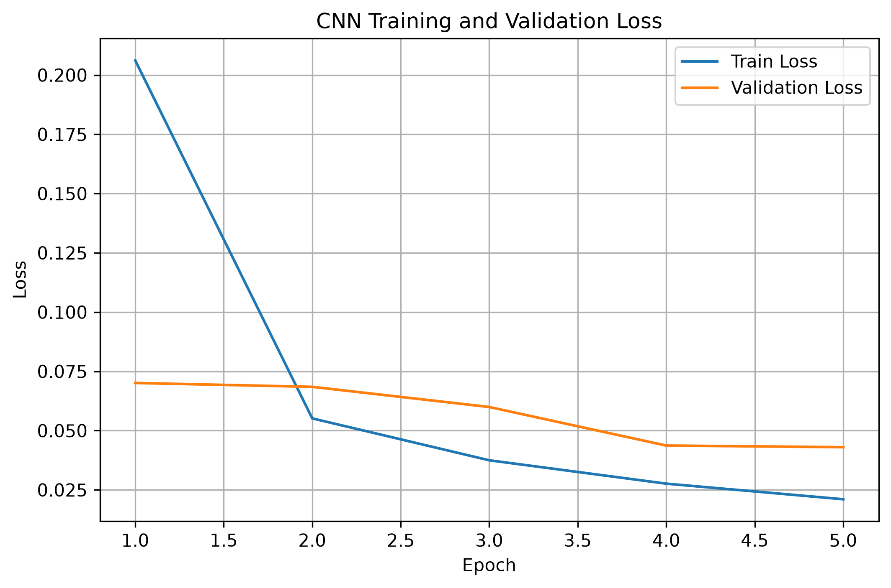
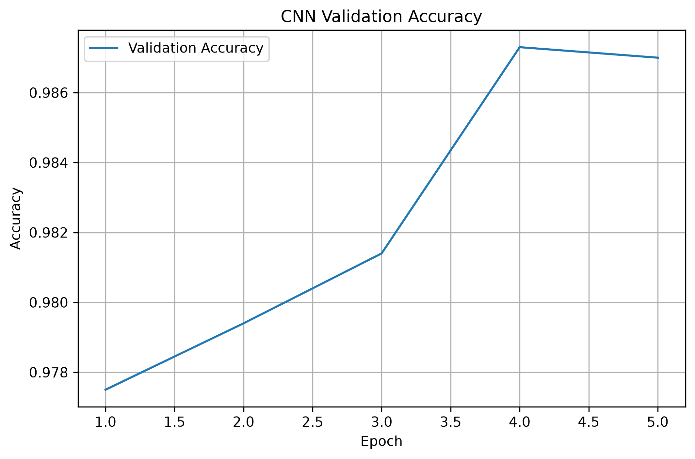
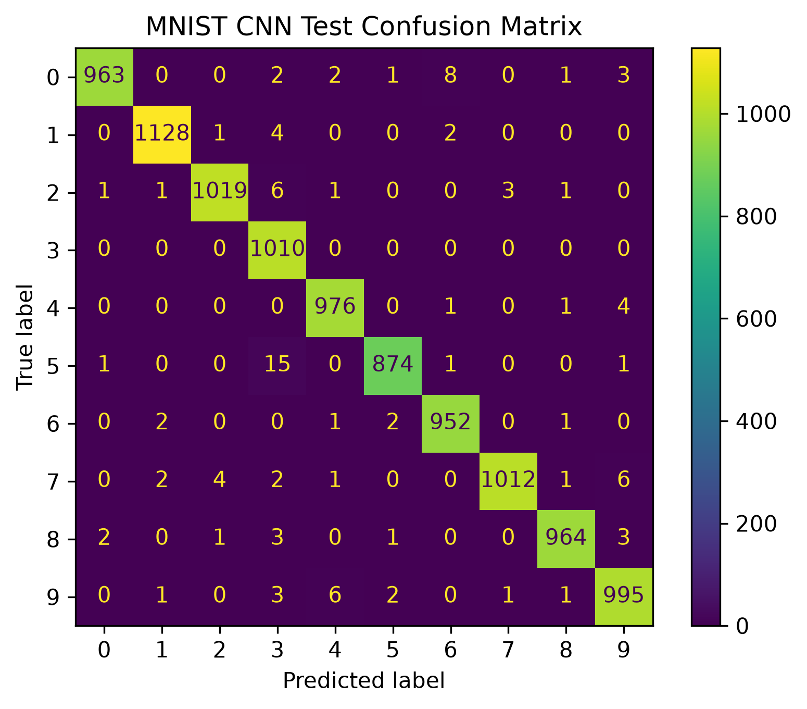
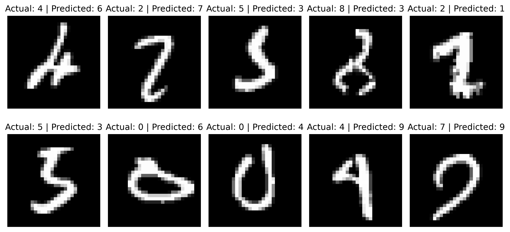

# MNIST Digit Classifier with PyTorch — CNN

## Overview

This project implements a handwritten digit classifier for the MNIST dataset using a **Convolutional Neural Network (CNN)** built with PyTorch.

The project demonstrates a complete machine learning workflow, including:

* Data preparation
* CNN model development
* Training and validation
* Model evaluation
* Performance analysis
* Visualization of predictions and errors

## Technologies

* Python
* PyTorch
* Torchvision
* NumPy
* Scikit-learn
* Matplotlib

## Model Architecture

The CNN uses two convolutional layers followed by fully connected layers.

```text
Input Image
1 × 28 × 28
      ↓
Conv2D: 1 → 32
3 × 3 Kernel
      ↓
ReLU
      ↓
MaxPool
      ↓
Conv2D: 32 → 64
3 × 3 Kernel
      ↓
ReLU
      ↓
MaxPool
      ↓
Flatten
      ↓
Linear: 64 × 7 × 7 → 128
      ↓
ReLU
      ↓
Linear: 128 → 10
      ↓
Output
```

The output contains 10 values corresponding to the ten digit classes (`0–9`).

## Dataset

The project uses the **MNIST handwritten digit dataset**.

The dataset is divided into:

| Dataset    | Samples |
| ---------- | ------: |
| Training   |  50,000 |
| Validation |  10,000 |
| Test       |  10,000 |

Each image has a resolution of **28 × 28 pixels** and is converted to a tensor using `ToTensor()`.

## Training

The model is trained using:

| Parameter     | Value            |
| ------------- | ---------------- |
| Optimizer     | Adam             |
| Learning Rate | 0.001            |
| Loss Function | CrossEntropyLoss |
| Batch Size    | 64               |
| Epochs        | 5                |

### Training Curves

#### Loss

The following plot shows the training and validation loss during training.



#### Validation Accuracy



## Evaluation

The model is evaluated on both the validation and test datasets using:

* Accuracy
* Precision
* Recall
* F1 Score

### Results

| Metric    | Validation |   Test |
| --------- | ---------: | -----: |
| Accuracy  |     99.45% | 98.93% |
| Precision |     99.46% | 98.94% |
| Recall    |     99.45% | 98.92% |
| F1 Score  |     99.45% | 98.92% |

## Confusion Matrix

The confusion matrix shows the classification performance for each digit class on the MNIST test dataset.



## Predictions

The following examples show correctly classified MNIST images together with their actual and predicted labels.


## Misclassified Examples

The following examples show images that were incorrectly classified by the model.



## Project Structure

```text
cnn/
├── README.md
├── src/
│   ├── model.py
│   ├── train.py
│   ├── evaluate.py
│   └── predict.py
│
└── models/
    ├── mnist_cnn.pth
    ├── loss_curve.png
    ├── accuracy_curve.png
    ├── confusion_matrix.png
    ├── predictions.png
    └── misclassified.png
```

## How to Run

From the project root:

### Train the model

```bash
python -m cnn.src.train
```

### Evaluate the model

```bash
python -m cnn.src.evaluate
```

### Generate predictions and misclassified examples

```bash
python -m cnn.src.predict
```

## What This Project Demonstrates

This project demonstrates practical experience with:

* Building convolutional neural networks using PyTorch
* Working with image data
* Using convolution and pooling layers
* Training models with backpropagation
* Using optimizers and loss functions
* Validating model performance
* Evaluating classification models
* Analyzing classification errors
* Visualizing machine learning results
